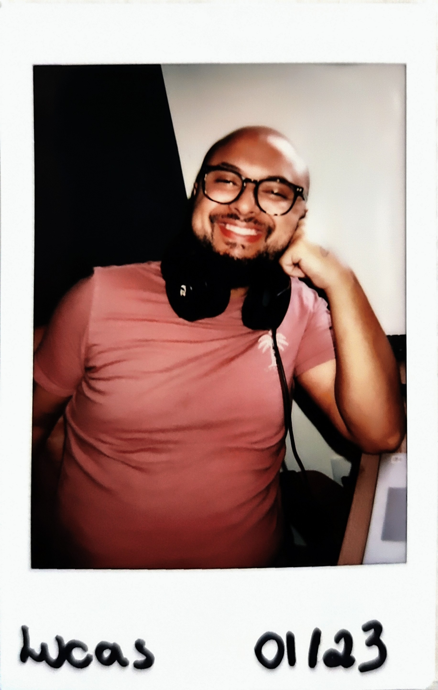

<h1>
Hello, world! 
</h1>

<table>
  <tbody>
    <tr>
        <i>
        Meu nome é Lucas, sou desenvolvedor front-end focado em desempenho e escalabilidade, especializado em construção de aplicações web utilizando React.JS e Next.JS.  
          Atualmente, sou membro da <a href="https://rarolabs.com.br/">RaroLabs</a>, onde utilizamos JavaScript e TypeScript para desenvolver projetos inovadores. Além disso, empregamos ferramentas avançadas de estilização, como Styled Components (CSS in JS), Sass, Material UI e Ant Design, para criar interfaces visualmente atraentes.   
        Tenho proficiência em testes unitários com Jest e adotamos metodologias ágeis para garantir a entrega eficiente e de alta qualidade de nossos produtos. Como parte do meu trabalho, também atuo no suporte de APIs utilizando Node.JS.  
        Estou constantemente em busca de desafios que me permitam expandir meu conhecimento e aprimorar minhas habilidades no desenvolvimento Front-End. Se você é uma pessoa interessada em discutir projetos ou compartilhar conhecimentos na área, fique à vontade para entrar em contato.  
        </i>
    </tr>
    <tr>
    <td>
        <i>
         
          My name is Lucas, and I am a performance and scalability-focused Front-End Developer specializing in building web applications using React.JS and Next.JS.  
          Currently, I am a member of <a href="https://rarolabs.com.br/">RaroLabs</a>, where we utilize JavaScript and TypeScript to develop innovative projects. Additionally, we employ advanced styling tools such as Styled Components (CSS in JS), Sass, Material UI, and Ant Design to create visually appealing interfaces.  
          I have proficiency in unit testing with Jest, and we adopt agile methodologies to ensure efficient and high-quality delivery of our products. As part of my work, I also engage in API support using Node.JS.  
          I am constantly seeking challenges that allow me to expand my knowledge and enhance my Front-End development skills. If you are someone interested in discussing projects or sharing insights in the field, please feel free to get in touch.  
        </i>
      </td>
      <td width="183">
          
        
      </td>
    </tr>
  </tbody>
</table>

>## 💻 Teck Stacks
>
>   
> 
>   
> 
> 
>
>   

 

>## 📞 Get in Touch
>
>  
